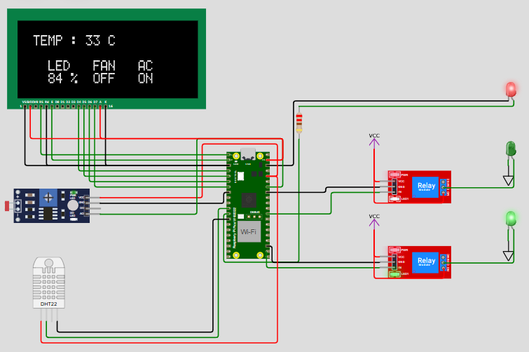
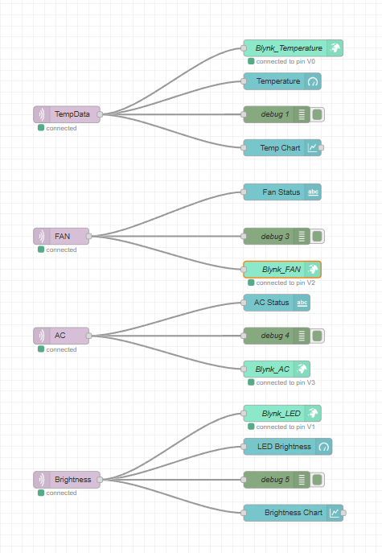
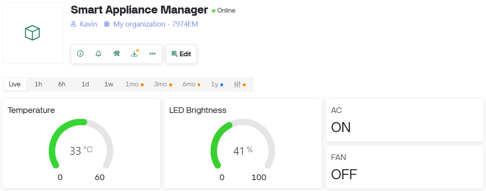

# Smart Home Environment Monitor

A microcontroller-based IoT project for monitoring temperature and ambient light, displaying status on an LCD, and controlling home appliances (LED, Fan, AC) automatically. Data is sent to Node-RED via MQTT for remote monitoring.

# Wokwi Simulator Link 

https://wokwi.com/projects/397129958534935553

## Features

- **Temperature & Humidity Sensing:** Uses DHT22 sensor.
- **Ambient Light Detection:** LDR sensor adjusts LED brightness.
- **Automatic Appliance Control:** Turns fan/AC on/off based on temperature.
- **LCD Display:** Shows real-time status of all devices.
- **MQTT Integration:** Publishes temperature data to Node-RED/dashboard.
- **WiFi Connectivity:** Connects to local WiFi for IoT features.

## Hardware Used

- ESP32 / Arduino (compatible with WiFi)
- DHT22 Temperature & Humidity Sensor
- LDR Sensor
- 16x2 or 20x4 LCD Display
- Relays for Fan and AC
- LED
- Breadboard, jumper wires

## Circuit Diagram

## Node Red Flow 

## Blynk Dashboard

## How It Works

1. **Sensor Readings:** DHT22 and LDR provide temperature and light data.
2. **Device Control:** Fan and AC are controlled based on temperature thresholds.
3. **LED Dimming:** LED brightness auto-adjusts to ambient light.
4. **LCD Display:** Shows temperature, LED %, Fan/AC status.
5. **MQTT Publishing:** Temperature data sent to topic on HiveMQ broker.
6. **Node-RED Integration:** Data can be visualized or used for further automation.

## Code

See [`src/main.ino`](src/main.ino).

## Setup Instructions

1. Clone this repo:
git clone https://github.com/yourusername/your-repo-name.git
2. Open `src/main.ino` in Arduino IDE.
3. Install required libraries:
- `DHT sensor library`
- `LiquidCrystal`
- `PubSubClient`
- `WiFi` (for ESP32)
4. Connect hardware as per the circuit diagram.
5. Update WiFi credentials in the code if needed.
6. Upload the code to your board.
7. Open Serial Monitor to view logs.

## Node-RED Flow Example

See [`src/main.ino`](src/main.ino).

## Author

- [Kavin Balaji](https://github.com/kavinbalaji2005)
